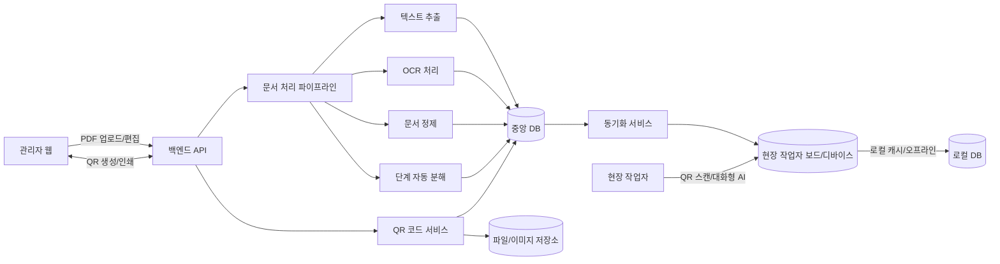

# 시스템 상세 명세 (Markdown)

## 0. 아키텍처 다이어그램 (Mermaid)



### 핵심 구조 요약
- **관리자 웹**만 중앙 서버/DB와 연결되어 PDF 업로드·편집·QR 생성 수행
- **작업자 보드**는 **중앙 DB와 동기화**하여 로컬 DB에 저장 후 사용
- 작업자는 **웹에 직접 연결하지 않고**, 보드에서 QR 스캔/대화형 AI로 안내 수신

## 1. REST API 명세서

### 1.1 인증 (선택)
- `Authorization: Bearer <token>` 헤더 사용 (필요 시)

---

### 1.2 매뉴얼 업로드

**POST** `/api/manuals`

- 설명: 작업 매뉴얼 PDF 업로드
- Content-Type: `multipart/form-data`

**요청**
```
file: PDF 파일
title: 매뉴얼 제목 (optional)
```

**응답 (201)**
```json
{
  "manualId": "m_123",
  "title": "작업 매뉴얼 A",
  "status": "processing"
}
```

---

### 1.3 매뉴얼 목록 조회

**GET** `/api/manuals`

**응답 (200)**
```json
[
  { "manualId": "m_123", "title": "작업 매뉴얼 A", "status": "ready" },
  { "manualId": "m_124", "title": "작업 매뉴얼 B", "status": "processing" }
]
```

---

### 1.4 매뉴얼 상세 조회

**GET** `/api/manuals/{manualId}`

**응답 (200)**
```json
{
  "manualId": "m_123",
  "title": "작업 매뉴얼 A",
  "status": "ready",
  "pages": 12
}
```

---

### 1.5 페이지 텍스트 조회

**GET** `/api/manuals/{manualId}/pages/{pageNo}`

**응답 (200)**
```json
{
  "pageNo": 3,
  "rawText": "...",
  "cleanedText": "..."
}
```

---

### 1.6 단계 목록 조회

**GET** `/api/manuals/{manualId}/steps`

**응답 (200)**
```json
[
  { "stepId": "s_1", "stepNo": 1, "content": "전원을 켠다." },
  { "stepId": "s_2", "stepNo": 2, "content": "안전장갑을 착용한다." }
]
```

---

### 1.7 단계 수정

**PATCH** `/api/manuals/{manualId}/steps/{stepId}`

**요청**
```json
{
  "content": "전원을 켜고 상태를 확인한다.",
  "stepNo": 1
}
```

**응답 (200)**
```json
{ "ok": true }
```

---

### 1.8 단계 순서 변경 (일괄)

**PUT** `/api/manuals/{manualId}/steps/reorder`

**요청**
```json
{
  "orders": [
    { "stepId": "s_3", "stepNo": 1 },
    { "stepId": "s_1", "stepNo": 2 }
  ]
}
```

**응답 (200)**
```json
{ "ok": true }
```

---

### 1.9 단계 분리

**POST** `/api/manuals/{manualId}/steps/{stepId}/split`

**요청**
```json
{
  "parts": [
    "전원을 켠다.",
    "상태를 확인한다."
  ]
}
```

**응답 (200)**
```json
{ "newStepIds": ["s_5", "s_6"] }
```

---

### 1.10 단계 통합

**POST** `/api/manuals/{manualId}/steps/merge`

**요청**
```json
{
  "stepIds": ["s_2", "s_3"],
  "content": "안전장갑을 착용하고 장비를 점검한다."
}
```

**응답 (200)**
```json
{ "mergedStepId": "s_8" }
```

---

### 1.11 QR 코드 생성

**POST** `/api/qrcodes`

**요청**
```json
{
  "manualId": "m_123",
  "type": "step",
  "stepId": "s_2"
}
```

**응답 (200)**
```json
{
  "qrId": "qr_77",
  "qrImageUrl": "/files/qr/qr_77.png"
}
```

---

### 1.12 QR 코드 조회

**GET** `/api/qrcodes/{qrId}`

**응답 (200)**
```json
{
  "qrId": "qr_77",
  "type": "step",
  "targetUrl": "https://example.com/steps/s_2"
}
```

---

## 2. DB 스키마 상세 정의

### 2.1 `manuals`

| 컬럼명 | 타입 | 설명 |
|---|---|---|
| id | varchar(50) PK | 매뉴얼 ID |
| title | varchar(255) | 제목 |
| pdf_url | text | 원본 PDF 저장 위치 |
| status | varchar(20) | processing / ready / failed |
| page_count | int | 총 페이지 수 |
| created_at | datetime | 생성일 |

---

### 2.2 `page_texts`

| 컬럼명 | 타입 | 설명 |
|---|---|---|
| id | varchar(50) PK | 페이지 텍스트 ID |
| manual_id | varchar(50) FK | manuals.id |
| page_no | int | 페이지 번호 |
| raw_text | longtext | OCR 또는 추출 텍스트 |
| cleaned_text | longtext | 정제 텍스트 |

---

### 2.3 `steps`

| 컬럼명 | 타입 | 설명 |
|---|---|---|
| id | varchar(50) PK | 단계 ID |
| manual_id | varchar(50) FK | manuals.id |
| step_no | int | 단계 번호 |
| content | text | 단계 안내문 |
| origin_page | int | 원본 페이지 추정 |
| created_at | datetime | 생성일 |

---

### 2.4 `qrcodes`

| 컬럼명 | 타입 | 설명 |
|---|---|---|
| id | varchar(50) PK | QR ID |
| type | varchar(20) | manual / step / process |
| manual_id | varchar(50) | 매뉴얼 ID |
| step_id | varchar(50) | 단계 ID (nullable) |
| qr_image_url | text | QR 이미지 파일 |
| target_url | text | 접근 URL |
| created_at | datetime | 생성일 |

---

## 3. OCR/텍스트 분해 알고리즘 의사코드

```pseudo
function processPdf(pdfFile):
    meta = analyzePdf(pdfFile)

    if hasTextLayer(pdfFile):
        pagesText = extractText(pdfFile)
    else:
        images = convertPdfToImages(pdfFile)
        pagesText = []
        for img in images:
            text = runOCR(img)
            pagesText.append(text)

    cleanedPages = []
    for text in pagesText:
        cleaned = cleanText(text)
        cleanedPages.append(cleaned)

    steps = splitIntoSteps(cleanedPages)
    return steps


function cleanText(text):
    removeHeaderFooter(text)
    normalizeWhitespace(text)
    keepListStructure(text)
    return text


function splitIntoSteps(pages):
    candidates = []
    for pageText in pages:
        lines = splitByLine(pageText)

        for line in lines:
            if matchesNumberedPattern(line):
                candidates.append(newStep(line))
            else if containsStepKeyword(line):
                candidates.append(newStep(line))
            else:
                appendToLastStep(line)

    mergeOrSplitByHeuristic(candidates)
    return candidates
```

---

## 4. 화면 와이어프레임 (관리자/작업자)

### 4.1 관리자 화면

```
[관리자 대시보드]
---------------------------------
| 매뉴얼 업로드 [파일선택][업로드] |
---------------------------------
| 매뉴얼 목록                    |
| - 작업 매뉴얼 A (ready)        |
| - 작업 매뉴얼 B (processing)   |
---------------------------------
```

```
[작업 단계 편집 화면]
------------------------------------------------
| 단계 목록                                    |
| [1] 전원을 켠다.           [수정][삭제]       |
| [2] 안전장갑 착용           [수정][삭제]       |
| [3] 장비 점검               [수정][삭제]       |
| (Drag & Drop)                               |
------------------------------------------------
| [단계 분리] [단계 통합] [저장]               |
------------------------------------------------
```

```
[QR 생성/인쇄 화면]
-----------------------------------------
| 생성 단위: ( ) 전체 (●) 단계 ( ) 공정  |
| 단계 선택: [2] 안전장갑 착용           |
| [QR 생성]                              |
-----------------------------------------
| QR 미리보기   [인쇄] [PDF 다운로드]     |
-----------------------------------------
```

---

### 4.2 작업자 화면 (QR 접근)

```
[작업 단계 안내]
---------------------------------
| STEP 2 / 8                      |
|                                 |
| 안전장갑을 착용한다.           |
|                                 |
| [이전]               [다음]      |
---------------------------------
| 글자크기 [+][-]  대비 [ON/OFF]   |
| 음성 안내 [▶]                   |
---------------------------------
```
